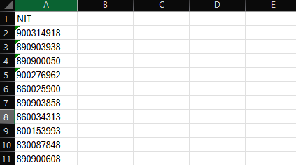
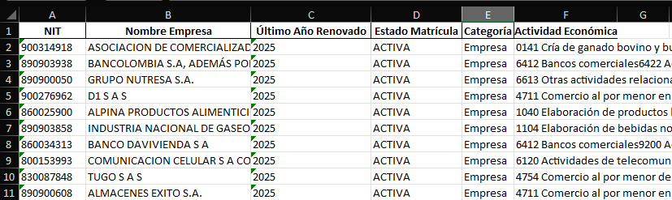

# Automatizador de Consulta RUES

## 📄 Descripción del Proyecto

Este es un automatizador de escritorio diseñado para simplificar el proceso de consulta de información en el portal del Registro Único Empresarial y Social (RUES) de Colombia. La aplicación utiliza una interfaz gráfica (GUI) para que el usuario seleccione un archivo de Excel con NITs. Luego, el sistema se conecta a la página del RUES, busca la información de cada NIT y guarda los resultados en un nuevo archivo de Excel.

## ✨ Características

* **Interfaz Gráfica (GUI):** Desarrollada con `tkinter` para una experiencia de usuario sencilla e intuitiva.
* **Automatización Web:** Utiliza `Selenium` para navegar y extraer datos del sitio web del RUES.
* **Procesamiento de Datos:** Lee y escribe archivos de Excel con la librería `pandas`.

## 🧪 Ejemplo de Funcionamiento
| Antes de la ejecución | Después de la ejecución |
|-----------------------|--------------------------|
|  |  |

## ⚙️ Requisitos

Para poder correr este proyecto, necesitas tener instalado lo siguiente:

* **Python:** Se recomienda usar Python 3.8 o superior.
* **Microsoft Edge:** El navegador debe estar instalado en tu sistema.
* **Controlador del Navegador:** El archivo `msedgedriver.exe` ya está incluido en la carpeta `drivers/` del proyecto y es compatible con el navegador Edge.

### 📦 Instalación de Dependencias

Todas las librerías de Python necesarias están listadas en el archivo `requirements.txt`. Para instalarlas, abre tu terminal y ejecuta el siguiente comando:

````bash

